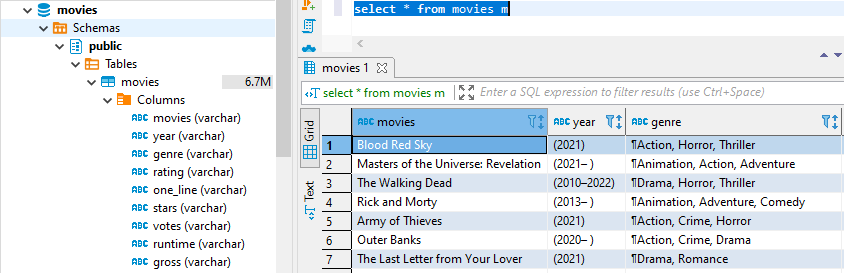

# PostgreSQL - ETL using Python

PostgreSQL - ETL using Python is the ETL project using Python in creating a table in the new PostgreSQL database. The raw data is stored in CSV file. This project create an ETL pipeline to get all the information from CSV file with the help of pandas python library and insert the data into the database.  
 

## Prerequisites

These are all libraries you need to install
- numpy
- pandas
- psycopg2

## Getting Started

First, before you to run your ETL pipeline, we need to create the database. To create the database, we firstly insert the parameter such as host, user, password and port. We create database namely 'movies'. Here is the code to create the database.

`python create_database.py`

After that, we create the table to the database 'movies' by inserting the parameter based on the previous one by added with the database name parameter created before. Here is the code to create the table to database 'movies'.

`python create_table.py`

This ETL pipeline get the CSV file and transform it based on schema of the table then insert the data to table. This process uses pandas library. Here is the code to insert the data from CSV file to the table.

`python insert_table.py`

Here is the view of the inserted table data through the ETL process.  

